# 🏥 NHÀ THUỐC LONG CHÂU - Hệ thống quản lý bán thuốc trực tuyến

## 📋 Tổng quan dự án

Đây là một hệ thống website bán thuốc trực tuyến được xây dựng bằng ASP.NET Core MVC, cung cấp đầy đủ các chức năng cho cả khách hàng và quản trị viên.

## 🎯 Mục tiêu dự án

- Xây dựng nền tảng thương mại điện tử chuyên biệt cho ngành dược phẩm
- Cung cấp trải nghiệm mua sắm thuận tiện và an toàn cho khách hàng
- Hệ thống quản lý toàn diện cho admin với các tính năng báo cáo và phân tích

## 🚀 Các chức năng chính

### 👥 **Phía khách hàng**

#### 🔐 **Quản lý tài khoản**
- Đăng ký, đăng nhập, đăng xuất
- Quên mật khẩu với xác thực email
- Hồ sơ cá nhân và cập nhật thông tin
- Hệ thống xếp hạng khách hàng (Bronze, Silver, Gold, Platinum)

#### 🛍️ **Mua sắm**
- Duyệt danh mục sản phẩm theo cấp độ (Level 1, 2, 3)
- Tìm kiếm sản phẩm theo tên, thương hiệu, danh mục
- Lọc sản phẩm theo giá, xuất xứ, thương hiệu
- Xem chi tiết sản phẩm với hình ảnh và đánh giá
- Giỏ hàng và thanh toán
- Theo dõi đơn hàng

#### 💬 **Tương tác**
- Đánh giá sản phẩm (chỉ sau khi mua)
- Chat trực tuyến với admin
- Nhận thông báo voucher mới

#### 🎁 **Khuyến mãi**
- Hệ thống voucher với nhiều loại giảm giá
- Voucher theo % hoặc số tiền cố định
- Voucher cho từng khách hàng hoặc tất cả

### 👨‍💼 **Phía quản trị (Admin)**

#### 📊 **Dashboard**
- Thống kê tổng quan: đơn hàng, doanh thu, sản phẩm, khách hàng
- Biểu đồ doanh thu theo tháng
- Thông báo đơn hàng chờ xác nhận và tin nhắn chưa đọc

#### 🛍️ **Quản lý sản phẩm**
- CRUD sản phẩm với hình ảnh
- Quản lý danh mục sản phẩm (3 cấp độ)
- Quản lý tồn kho và xuất xứ
- Tìm kiếm và lọc sản phẩm

#### 📦 **Quản lý đơn hàng**
- Xem danh sách đơn hàng
- Cập nhật trạng thái đơn hàng
- Tìm kiếm đơn hàng theo tên, số điện thoại
- Lọc theo trạng thái

#### 🎫 **Quản lý voucher**
- Tạo voucher mới
- Phân phối voucher cho khách hàng
- Theo dõi sử dụng voucher
- Xóa voucher

#### 🖼️ **Quản lý banner**
- CRUD banner với hình ảnh
- Phân loại banner (chính, phụ, khuyến mãi)
- Sắp xếp thứ tự hiển thị
- Bulk delete banner

#### 👥 **Quản lý người dùng**
- Xem danh sách khách hàng
- Thông tin xếp hạng và chi tiêu
- Export danh sách ra Excel
- Khóa/mở khóa tài khoản

#### 💬 **Quản lý chat**
- Chat trực tuyến với khách hàng
- Thông báo tin nhắn chưa đọc
- Lịch sử chat

## 🏗️ Kiến trúc hệ thống

### **Mô hình MVC**
- **Model**: Entity Framework Core với SQL Server
- **View**: Razor Pages với Bootstrap 5
- **Controller**: ASP.NET Core Controllers

### **Bảo mật**
- ASP.NET Core Identity cho xác thực
- Role-based authorization (Admin/User)
- CSRF protection
- Input validation

### **Database**
- SQL Server với Entity Framework Core
- Code-first migrations
- Relationships: One-to-Many, Many-to-Many

## 🛠️ Công nghệ sử dụng

### **Backend**
- **.NET**: ASP.NET Core 8.0 (`TargetFramework: net8.0`)
- **EF Core**: Microsoft.EntityFrameworkCore.SqlServer 9.x, Tools 9.x, Design 9.x
- **Identity**: Microsoft.AspNetCore.Identity.EntityFrameworkCore 8.0, Identity UI 8.0
- **SignalR**: Realtime chat với `ChatHub` (Microsoft.AspNetCore.SignalR)
- **Background jobs**: `MonthlyVoucherHostedService` (Hosted Service)
- **Email**: SMTP (`IEmailSender`, `SmtpEmailSender`, cấu hình `EmailSettings`)
- **Thanh toán**: Tích hợp PayOS (`IPayOSService`, `PayOSService`)

### **Frontend**
- Razor Views (MVC)
- Bootstrap 5, jQuery, Font Awesome
- Static assets trong `wwwroot/` (CSS/JS/Images)

### **Database**
- SQL Server
- EF Core Migrations (thư mục `Migrations/`)

## 📁 Cấu trúc dự án

```
web-ban-thuoc/
├── Controllers/           # Controllers cho MVC
│   ├── Admin/           # Admin controllers
│   └── Auth/            # Authentication
├── Models/              # Entity models & ViewModels
├── Views/               # Razor views
│   ├── Admin/          # Admin views
│   ├── Auth/           # Authentication views
│   └── Shared/         # Shared layouts
├── Services/            # Business logic services
├── ViewComponents/      # Reusable UI components
├── wwwroot/            # Static files (CSS, JS, Images)
└── Migrations/         # Database migrations
```

## 🚀 Hướng dẫn chạy dự án

### **Phương pháp 1: Docker Compose**

#### Yêu cầu
- Docker Desktop
- Git

#### Các bước thực hiện
1. **Clone repository:**
   ```bash
   git clone https://github.com/nghieee/doAnWebNC
   cd doAnWebNC
   ```

2. **Chạy với Docker Compose:**
   ```bash
   docker-compose up --build
   ```

3. **Truy cập ứng dụng:**
   - Website: http://localhost:5000
   - SQL Server: localhost:14330 (SA_PASSWORD: YourStrong@Passw0rd)

4. **Kết nối SSMS (tùy chọn):**
   - Server: `localhost,14330`
   - Authentication: SQL Server Authentication
   - Login: `sa`
   - Password: `YourStrong@Passw0rd`

### **Phương pháp 2: Chạy thủ công**

#### Yêu cầu hệ thống
- .NET 8.0 SDK
- SQL Server
- Visual Studio 2022 hoặc VS Code

#### Cài đặt
1. Clone repository
2. Cập nhật connection string trong `appsettings.json`
3. Chạy migrations: `dotnet ef database update`
4. Chạy dự án: `dotnet run`

### **Tài khoản mặc định**
- **Admin**: `admin@gmail.com` / `Admin123.`
- (Bạn có thể đổi trong `Program.cs`)

## 🖼️ Ảnh chụp màn hình

### Trang chủ
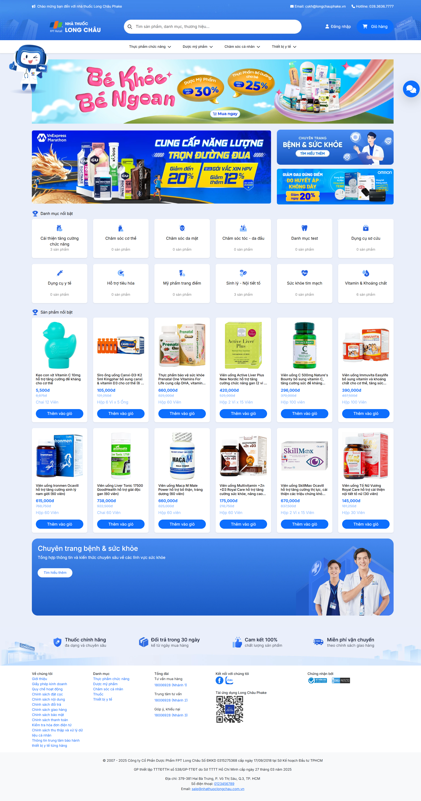
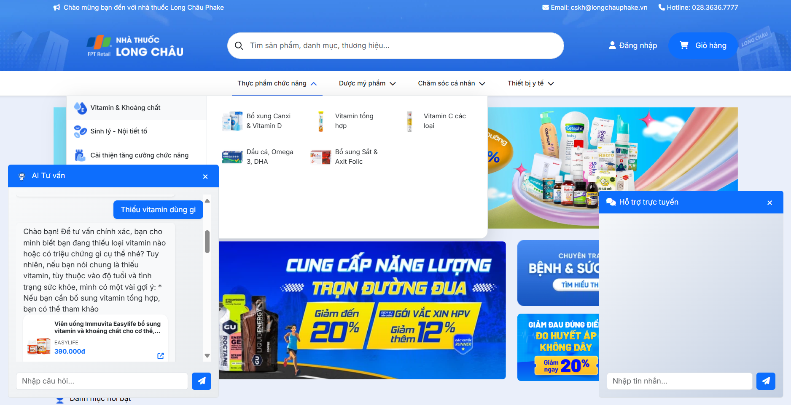

### Danh mục sản phẩm
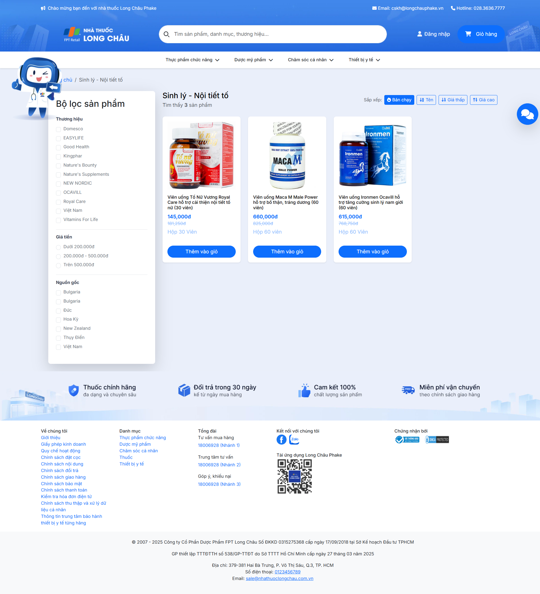

### Chi tiết sản phẩm
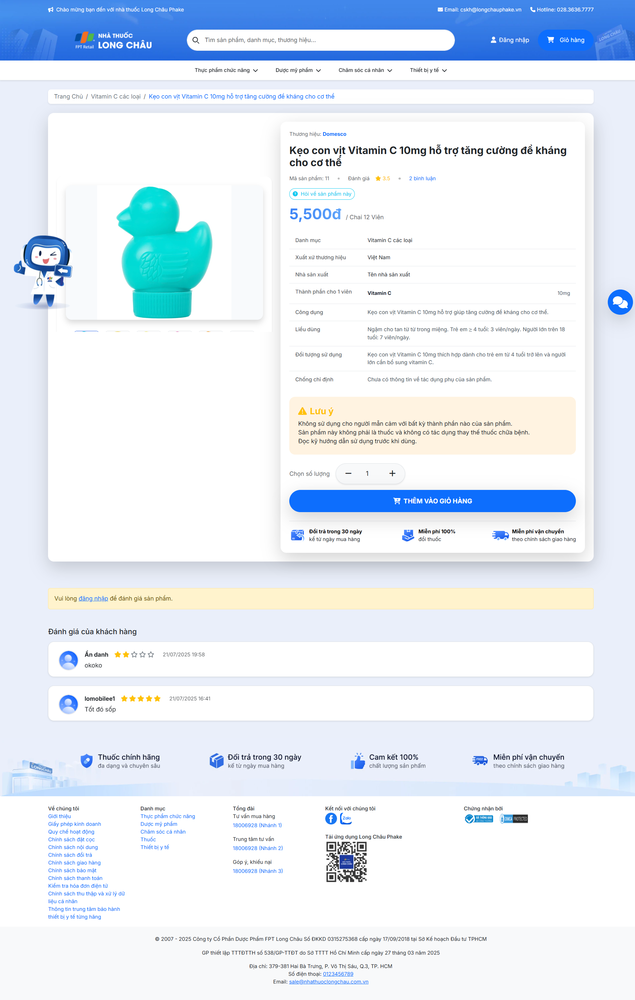

### Đăng nhập/Đăng ký
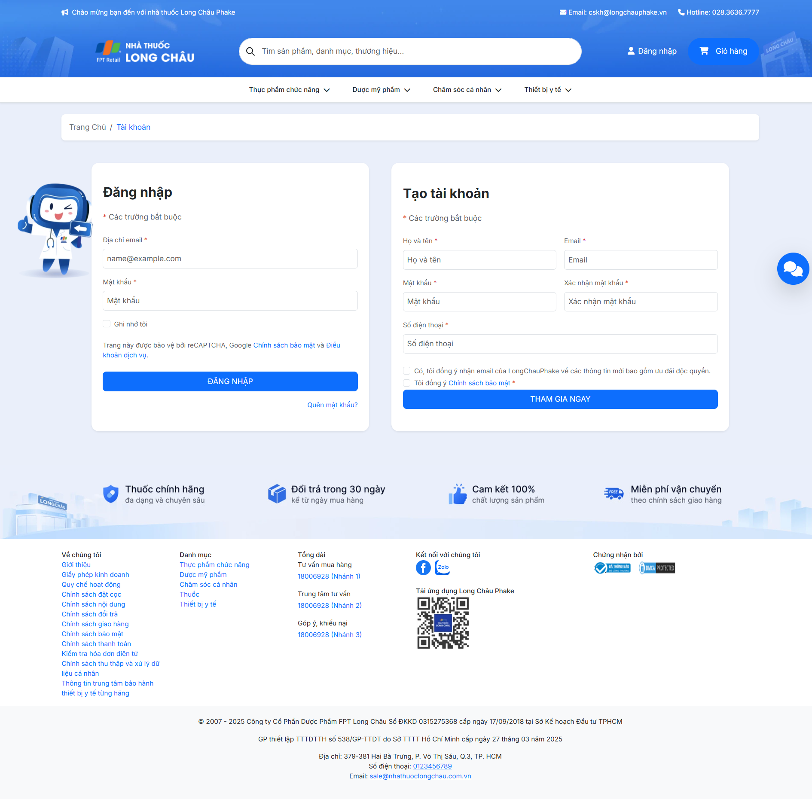

### Giỏ hàng
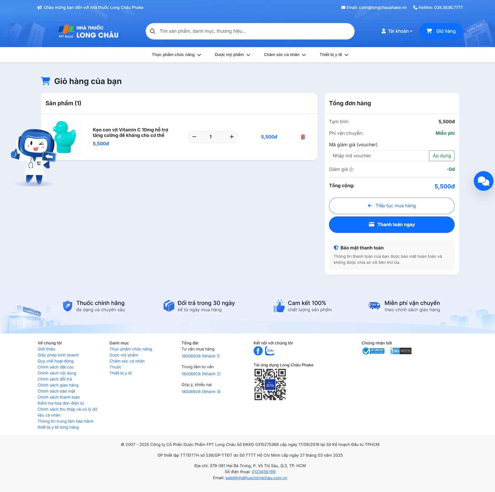

### Thanh toán Online
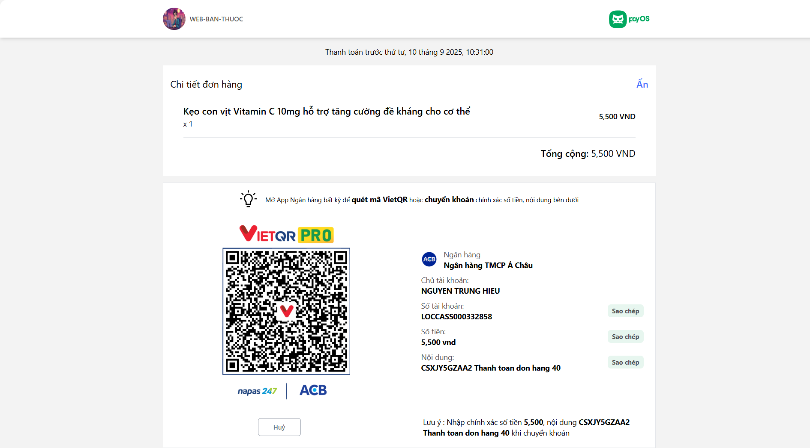

### Profile
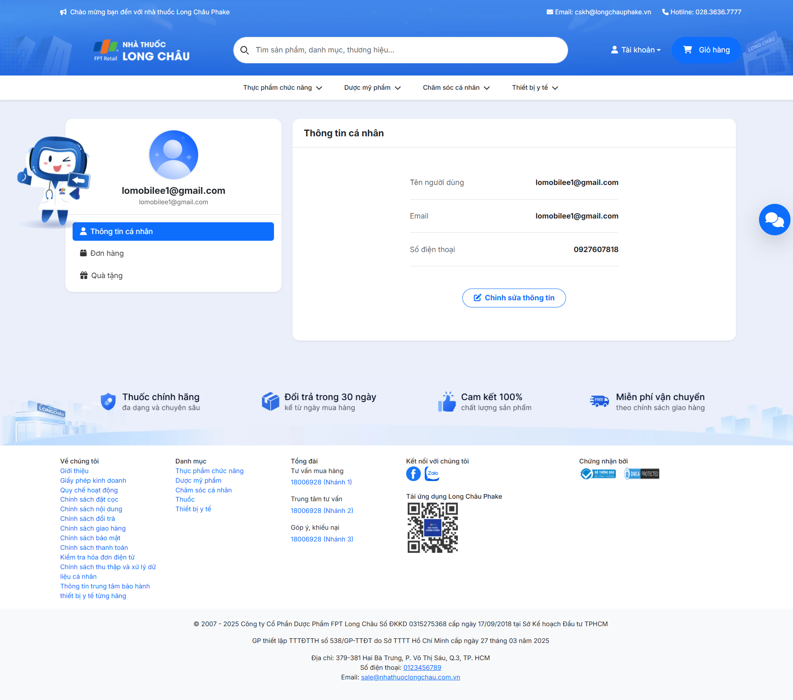

### Checkout
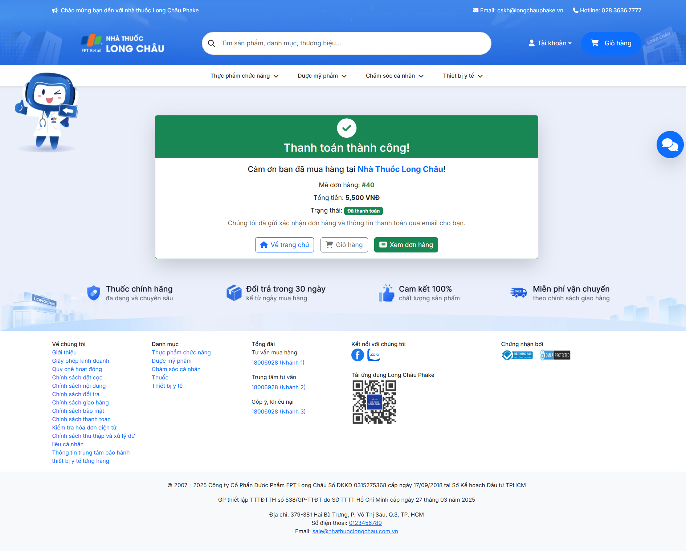

### Admin Dashboard
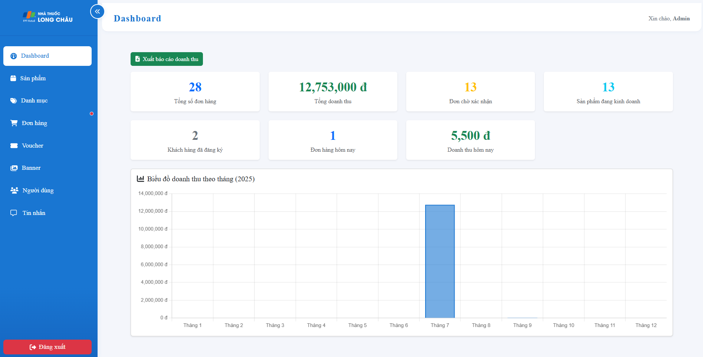

### Admin Quản lý sản phẩm
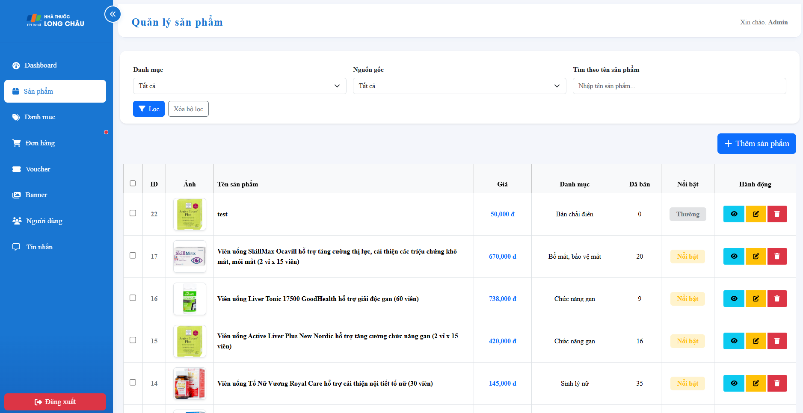

### Admin Thêm sản phẩm
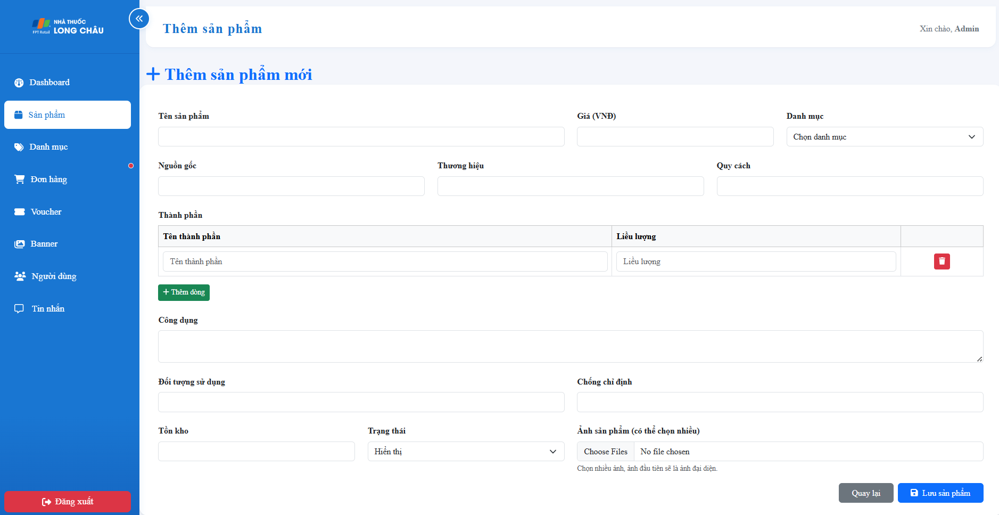

## 📈 Tính năng nổi bật

### **Hệ thống xếp hạng khách hàng**
- Tự động tính toán dựa trên tổng chi tiêu
- 4 cấp độ: Bronze, Silver, Gold, Platinum
- Reset hàng tháng

### **Real-time chat**
- SignalR cho chat trực tuyến
- Thông báo tin nhắn mới
- Lịch sử chat

### **Hệ thống voucher thông minh**
- Nhiều loại giảm giá
- Phân phối tự động
- Theo dõi sử dụng

### **Quản lý banner linh hoạt**
- Upload hình ảnh
- Phân loại và sắp xếp
- Bulk operations

## 🔒 Bảo mật

- Xác thực bằng ASP.NET Core Identity
- Phân quyền theo role
- Bảo vệ CSRF
- Validation dữ liệu đầu vào
- Mã hóa mật khẩu

## 📊 Báo cáo và thống kê

- Dashboard với biểu đồ doanh thu
- Thống kê đơn hàng theo thời gian
- Báo cáo sản phẩm bán chạy
- Export dữ liệu ra Excel

## 🎨 Giao diện

- Responsive design với Bootstrap 5
- Giao diện admin hiện đại
- UX/UI thân thiện
- Loading states và animations

## 🔄 Phiên bản

**Version**: 1.0.0  
**Ngày cập nhật**: 2024  
**Tác giả**: Hieu Nguyen

---

*Dự án được phát triển cho mục đích học tập và nghiên cứu.* 
