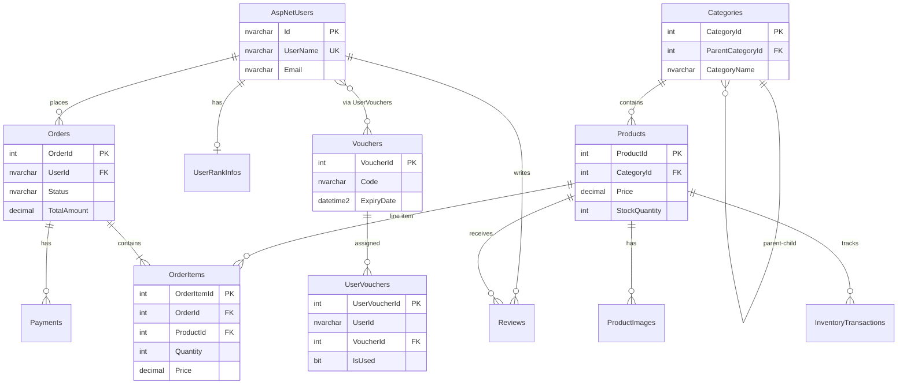

# BÁO CÁO 1 – THIẾT KẾ CƠ SỞ DỮ LIỆU
## Website bán thuốc trực tuyến (Nhà thuốc Long Châu)

| Thông tin | Nội dung |
|-----------|----------|
| **Tên nhóm** | *(điền)* |
| **Họ tên SV** | Nguyễn Trung Hiếu *(điền MSSV nếu cần)* |
| **Tên đề tài** | Hệ thống website bán thuốc trực tuyến |
| **Phạm vi nghiệp vụ** | Bán thuốc OTC trực tuyến: quản lý danh mục/sản phẩm, giỏ hàng & đặt hàng, thanh toán (COD/PayOS), voucher, xếp hạng khách hàng, đánh giá, chat hỗ trợ, quản trị (admin). **Không** bao gồm kê đơn thuốc theo toa bác sĩ, quản lý kho đa chi nhánh. |
| **CSDL** | Microsoft SQL Server, EF Core Code-First (`LongChauDbContext`) |

---

## 1. Sơ đồ ERD

### 1.1. Mô tả thực thể chính (nghiệp vụ)

| Thực thể | Mô tả |
|----------|--------|
| **USER** (`AspNetUsers`) | Tài khoản khách hàng & admin (Identity) |
| **ROLE** (`AspNetRoles`) | Vai trò: User, Admin |
| **CATEGORY** | Danh mục sản phẩm nhiều cấp (cha–con) |
| **PRODUCT** | Sản phẩm thuốc/TP chức năng |
| **PRODUCT_IMAGE** | Ảnh sản phẩm |
| **ORDER** | Đơn hàng (kể cả giỏ `Cart`) |
| **ORDER_ITEM** | Chi tiết dòng đơn |
| **PAYMENT** | Giao dịch thanh toán |
| **VOUCHER** | Mã giảm giá |
| **USER_VOUCHER** | Voucher được cấp cho từng user |
| **USER_RANK_INFO** | Hạng thành viên (Bạc/Vàng/Bạch kim) |
| **REVIEW** | Đánh giá sản phẩm |
| **CHAT_MESSAGE** | Tin nhắn chat |
| **BANNER** | Banner trang chủ |
| **INVENTORY_TRANSACTION** | Biến động tồn kho (mở rộng) |

### 1.2. Sơ đồ ERD (Mermaid – vẽ lại bằng Draw.io / dbdiagram.io)



**Ghi chú khi vẽ ERD in giấy:**
- Bảng Identity (`AspNetRoles`, `AspNetUserRoles`, …) có thể gom thành khối **USER/ROLE** hoặc vẽ riêng nếu GV yêu cầu đủ bảng.
- `UserVouchers.UserId` hiện **chưa có FK** tới `AspNetUsers` trong DB (chỉ ràng buộc ở tầng ứng dụng).
- `Vouchers.CategoryId` lưu tham chiếu danh mục nhưng **chưa có FK** trong migration.

---

## 2. Danh sách ràng buộc toàn vẹn (RBTV)

### 2.1. Business Constraint (8 quy tắc – từ nghiệp vụ dự án)

| ID | Business Rule / Constraint | Related Table | Related Attribute | Enforcement Method |
|----|---------------------------|---------------|-------------------|-------------------|
| BC01 | Mỗi khách hàng chỉ có **tối đa một giỏ hàng** đang mở (`Status = 'Cart'`) | Orders | UserId, Status | Application logic (`CartController`) |
| BC02 | Số lượng mỗi dòng trong giỏ **1–99** | OrderItems | Quantity | Application logic (`UpdateQuantity`) |
| BC03 | Chỉ đánh giá sản phẩm khi **đã mua** (đơn `Đã giao` hoặc `Đã thanh toán`) | Reviews, Orders, OrderItems | UserId, ProductId, Status | Application logic (`ProductController.AddReview`) |
| BC04 | Mỗi user chỉ **một đánh giá** trên một sản phẩm | Reviews | UserId, ProductId | Application logic (kiểm tra trước khi insert) |
| BC05 | Voucher chỉ dùng khi **còn hạn**, **IsActive**, **UsedCount < MaxUsage** (nếu có) và user được cấp (`UserVoucher`, `IsUsed = false`) | Vouchers, UserVouchers, Orders | ExpiryDate, IsActive, UsedCount, MaxUsage, IsUsed | Application logic (`CartController`, Admin) |
| BC06 | Hạng thành viên: **Bạc** &lt; 5tr, **Vàng** ≥ 5tr, **Bạch kim** ≥ 10tr (chi tiêu **6 tháng**, đơn `Đã giao`); reset chu kỳ 180 ngày | UserRankInfos, Orders | TotalSpent6Months, Rank, LastRankReset, Status | Application logic (`UserRankService`) |
| BC07 | Trạng thái đơn chỉ chuyển theo luồng nghiệp vụ (không từ `Cart`/`Đã hủy` sang trạng thái khác tùy ý) | Orders | Status | Application logic (`AdminOrderController`) |
| BC08 | Sản phẩm hiển thị nổi bật trang chủ: `IsFeature = 1`, `IsActive = 1`, **tồn kho > 0** | Products | IsFeature, IsActive, StockQuantity | Application logic (`HomeController`) |

*Bổ sung gợi ý (nếu muốn đủ 10):*
- BC09: Giá dòng đơn (`OrderItems.Price`) = giá tại thời điểm đặt (snapshot) — Application logic khi thêm giỏ.
- BC10: Thanh toán PayOS: `Payments.TransactionId` lưu mã giao dịch — Application + PayOS API.

### 2.2. Structure Constraint (ràng buộc cấu trúc)

| ID | Description | Table | Column | Constraint Type |
|----|-------------|-------|--------|-----------------|
| SC01 | Khóa chính danh mục | Categories | CategoryId | PK, IDENTITY |
| SC02 | Khóa chính sản phẩm | Products | ProductId | PK, IDENTITY |
| SC03 | FK: sản phẩm thuộc danh mục | Products | CategoryId | FK → Categories(CategoryId) |
| SC04 | FK: danh mục cha | Categories | ParentCategoryId | FK → Categories(CategoryId) |
| SC05 | Khóa chính đơn hàng | Orders | OrderId | PK, IDENTITY |
| SC06 | FK: đơn thuộc user | Orders | UserId | FK → AspNetUsers(Id), ON DELETE SET NULL |
| SC07 | Khóa chính chi tiết đơn | OrderItems | OrderItemId | PK, IDENTITY |
| SC08 | FK: chi tiết → đơn, sản phẩm | OrderItems | OrderId, ProductId | FK |
| SC09 | Khóa chính thanh toán | Payments | PaymentId | PK, IDENTITY |
| SC10 | FK: thanh toán → đơn | Payments | OrderId | FK → Orders(OrderId) |
| SC11 | Khóa chính voucher | Vouchers | VoucherId | PK, IDENTITY |
| SC12 | FK: user_voucher → voucher | UserVouchers | VoucherId | FK, ON DELETE CASCADE |
| SC13 | PK 1-1 xếp hạng user | UserRankInfos | UserId | PK (= FK logic tới AspNetUsers) |
| SC14 | FK: đánh giá → sản phẩm, user | Reviews | ProductId, UserId | FK |
| SC15 | FK: ảnh SP → sản phẩm | ProductImages | ProductId | FK, ON DELETE CASCADE |
| SC16 | NOT NULL tên sản phẩm | Products | ProductName | NOT NULL |
| SC17 | NOT NULL giá | Products | Price | NOT NULL, decimal(18,2) |
| SC18 | NOT NULL mã voucher | Vouchers | Code | NOT NULL |
| SC19 | UNIQUE username (Identity) | AspNetUsers | NormalizedUserName | UNIQUE (filtered index) |
| SC20 | PK Identity Role | AspNetRoles | Id | PK |

---

## 3. Lược đồ quan hệ

Ký hiệu: **PK** = khóa chính, **FK** = khóa ngoại, *gạch chân* = PK.

### 3.1. Bảng nghiệp vụ chính

```
Categories (
  CategoryId      INT          PK, IDENTITY,
  CategoryName    NVARCHAR     NOT NULL,
  Description     NVARCHAR,
  ImageUrl        NVARCHAR,
  ParentCategoryId INT         FK → Categories.CategoryId,
  IsFeature       BIT,
  CategoryLevel   NVARCHAR,
  ProductCount    INT
)

Products (
  ProductId       INT          PK, IDENTITY,
  ProductName     NVARCHAR     NOT NULL,
  Brand           NVARCHAR,
  Price           DECIMAL(18,2) NOT NULL,
  Package         NVARCHAR,
  CategoryId      INT          FK → Categories,
  Ingredients     NVARCHAR,
  Uses            NVARCHAR,
  Dosage          NVARCHAR,
  TargetUsers     NVARCHAR,
  Contraindications NVARCHAR,
  IsFeature       BIT,
  Origin          NVARCHAR,
  StockQuantity   INT          NOT NULL,
  IsActive        BIT,
  IngredientUnit  NVARCHAR,
  Slug            NVARCHAR,
  SoldQuantity    INT
)

ProductImages (
  ProductImageId  INT          PK, IDENTITY,
  ProductId       INT          FK → Products, NOT NULL,
  ImageUrl        NVARCHAR     NOT NULL,
  IsMain          BIT,
  SortOrder       INT
)

Orders (
  OrderId         INT          PK, IDENTITY,
  UserId          NVARCHAR(450) FK → AspNetUsers,
  OrderDate       DATETIME2,
  TotalAmount     DECIMAL(18,2),
  Status          NVARCHAR,    -- Cart | Chờ xác nhận | Đã xác nhận | Đang giao | Đã giao | Hủy
  ShippingAddress NVARCHAR,
  PaymentStatus   NVARCHAR,
  FullName        NVARCHAR,
  Phone           NVARCHAR,
  VoucherCode     NVARCHAR,
  VoucherDiscount DECIMAL(18,2)
)

OrderItems (
  OrderItemId     INT          PK, IDENTITY,
  OrderId         INT          FK → Orders,
  ProductId       INT          FK → Products,
  Quantity        INT          NOT NULL,
  Price           DECIMAL(18,2) NOT NULL
)

Payments (
  PaymentId       INT          PK, IDENTITY,
  OrderId         INT          FK → Orders,
  Amount          DECIMAL(18,2),
  PaymentDate     DATETIME2,
  PaymentMethod   NVARCHAR,    -- COD | PayOS
  PaymentStatus   NVARCHAR,
  TransactionId   NVARCHAR
)

Vouchers (
  VoucherId       INT          PK, IDENTITY,
  Code            NVARCHAR     NOT NULL,
  Description     NVARCHAR     NOT NULL,
  ExpiryDate      DATETIME2    NOT NULL,
  DiscountAmount  DECIMAL(18,2),
  IsActive        BIT,
  DiscountType    NVARCHAR     NOT NULL,  -- FullOrder | Category
  PercentValue    DECIMAL(18,2),
  CategoryId      INT,
  CategoryName    NVARCHAR,
  Detail          NVARCHAR,
  MaxUsage        INT,
  UsedCount       INT
)

UserVouchers (
  UserVoucherId   INT          PK, IDENTITY,
  UserId          NVARCHAR     NOT NULL,
  VoucherId       INT          FK → Vouchers, NOT NULL,
  IsUsed          BIT,
  UsedDate        DATETIME2,
  IsNew           BIT
)

UserRankInfos (
  UserId          NVARCHAR(450) PK,
  Rank            NVARCHAR     NOT NULL,
  TotalSpent      DECIMAL(18,2),
  TotalSpent6Months DECIMAL(18,2),
  LastRankReset   DATETIME2,
  LastRankMailSent DATETIME2,
  LastNotiMailSent DATETIME2
)

Reviews (
  ReviewId        INT          PK, IDENTITY,
  UserId          NVARCHAR(450) FK → AspNetUsers,
  ProductId       INT          FK → Products,
  Rating          INT,
  Comment         NVARCHAR,
  ReviewDate      DATETIME2
)

ChatMessages (
  Id              INT          PK, IDENTITY,
  SenderId        NVARCHAR,
  ReceiverId      NVARCHAR,
  Message         NVARCHAR     NOT NULL,
  SentAt          DATETIME2,
  IsRead          BIT
)

Banners (
  BannerId        INT          PK, IDENTITY,
  Title           NVARCHAR(100) NOT NULL,
  Description     NVARCHAR(200),
  ImageUrl        NVARCHAR     NOT NULL,
  LinkUrl         NVARCHAR(200),
  BannerType      NVARCHAR     NOT NULL,
  SortOrder       INT,
  IsActive        BIT,
  CreatedAt       DATETIME2,
  UpdatedAt       DATETIME2
)

InventoryTransactions (
  TransactionId   INT          PK, IDENTITY,
  ProductId       INT          FK → Products,
  QuantityChange  INT,
  TransactionDate DATETIME2,
  TransactionType NVARCHAR
)
```

### 3.2. Bảng Identity (ASP.NET Core)

```
AspNetUsers (Id PK, UserName, Email, PasswordHash, PhoneNumber, ...)
AspNetRoles (Id PK, Name, ...)
AspNetUserRoles (UserId FK, RoleId FK) — PK composite
AspNetUserClaims, AspNetRoleClaims, AspNetUserLogins, AspNetUserTokens
```

---

## 4. Data Dictionary (mẫu – lặp cho từng bảng trong báo cáo)

### 4.1. Bảng Products

| Column | Type | Size | Constraints | Description |
|--------|------|------|-------------|-------------|
| ProductId | INT | 4 | PK, IDENTITY | Mã sản phẩm |
| ProductName | NVARCHAR | MAX | NOT NULL | Tên thuốc/sản phẩm |
| Brand | NVARCHAR | MAX | | Hãng / thương hiệu |
| Price | DECIMAL | 18,2 | NOT NULL | Đơn giá bán (VNĐ) |
| CategoryId | INT | 4 | FK | Thuộc danh mục |
| StockQuantity | INT | 4 | NOT NULL | Số lượng tồn kho |
| IsActive | BIT | 1 | | Ẩn/hiện trên web |
| IsFeature | BIT | 1 | | Sản phẩm nổi bật |
| Origin | NVARCHAR | MAX | | Xuất xứ |
| Ingredients | NVARCHAR | MAX | | Thành phần |
| Uses | NVARCHAR | MAX | | Công dụng |
| Dosage | NVARCHAR | MAX | | Liều dùng |
| SoldQuantity | INT | 4 | | Đã bán (thống kê) |

### 4.2. Bảng Orders

| Column | Type | Size | Constraints | Description |
|--------|------|------|-------------|-------------|
| OrderId | INT | 4 | PK, IDENTITY | Mã đơn |
| UserId | NVARCHAR | 450 | FK | Khách đặt |
| OrderDate | DATETIME2 | | | Ngày đặt |
| TotalAmount | DECIMAL | 18,2 | | Tổng tiền sau giảm |
| Status | NVARCHAR | MAX | | Trạng thái đơn |
| ShippingAddress | NVARCHAR | MAX | | Địa chỉ giao |
| FullName | NVARCHAR | MAX | | Tên người nhận |
| Phone | NVARCHAR | MAX | | SĐT nhận hàng |
| VoucherCode | NVARCHAR | MAX | | Mã voucher đã áp |
| VoucherDiscount | DECIMAL | 18,2 | | Số tiền giảm |

### 4.3. Bảng Vouchers

| Column | Type | Size | Constraints | Description |
|--------|------|------|-------------|-------------|
| VoucherId | INT | 4 | PK, IDENTITY | Mã voucher (nội bộ) |
| Code | NVARCHAR | MAX | NOT NULL | Mã hiển thị cho KH |
| DiscountType | NVARCHAR | MAX | NOT NULL | FullOrder / Category |
| PercentValue | DECIMAL | 18,2 | | % giảm |
| DiscountAmount | DECIMAL | 18,2 | | Giảm cố định (VNĐ) |
| ExpiryDate | DATETIME2 | | NOT NULL | Hạn dùng |
| MaxUsage | INT | 4 | | Lượt dùng tối đa (null = ∞) |
| UsedCount | INT | 4 | | Đã sử dụng |
| IsActive | BIT | 1 | | Còn hiệu lực |

*(Các bảng còn lại: copy cùng format từ mục 3 hoặc xuất từ SQL Server / EF snapshot.)*

---

## 5. Thông tin cần bạn bổ sung trước khi nộp

1. **Tên nhóm**, **MSSV**, **lớp**, **giảng viên** (trang bìa mẫu Excel/Word).
2. **ERD hình vẽ**: dùng Mermaid trên, [dbdiagram.io](https://dbdiagram.io), Draw.io, hoặc SQL Server Diagram — **in màu/thang đo rõ**.
3. **Có gộp bảng Identity không?** Nếu GV chỉ yêu cầu nghiệp vụ → chỉ vẽ 12 bảng mục 1.1; nếu yêu cầu đủ → thêm 6 bảng `AspNet*`.
4. **Domain CHECK trong SQL**: hiện dự án chủ yếu enforce bằng **Application logic** — nếu môn bắt `CHECK` trên DB, cần viết thêm script (ví dụ `StockQuantity >= 0`, `Rating BETWEEN 1 AND 5`).
5. **Thiếu FK trong code**: `UserVouchers.UserId` → `AspNetUsers`, `Vouchers.CategoryId` → `Categories` — nên ghi trong báo cáo là *“dự kiến bổ sung”* hoặc nêu rõ đang ràng buộc ở tầng ứng dụng.
6. File `docs/screenshots/ERD.jpg` được nhắc trong tài liệu đồ án nhưng **chưa có trong repo** — cần chụp/xuất ERD mới.

---

*Tài liệu sinh từ mã nguồn: `web-ban-thuoc/Models/*`, `LongChauDbContext.cs`, `Migrations/LongChauDbContextModelSnapshot.cs`, `docs/Chuong2-PhanTichThietKeHeThong.md`.*
